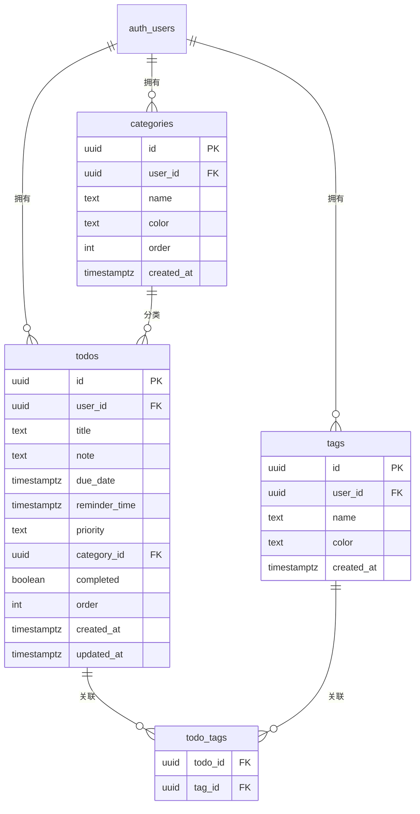

# Trae Todo 待办应用开发计划

## 项目概述

基于 React 18 + TypeScript 技术栈开发的现代化任务管理应用，支持云端同步、GitHub OAuth 登录和 Vercel 部署。

---

## 一、产品需求文档 (PRD)

### 1. 产品概述

一款简洁高效的 Web 端待办事项管理应用，帮助用户轻松管理日常任务，提升工作效率。支持多维度分类、云端同步和灵活排序，让任务管理井井有条。

### 2. 核心功能

#### 2.1 功能模块

1. **用户认证**: GitHub OAuth 登录、会话管理、退出登录
2. **任务管理**: 创建、编辑、删除、标记完成、拖拽排序
3. **视图筛选**: 今日/本周/逾期/已完成任务视图
4. **分类标签**: 创建、编辑、删除分类和标签
5. **搜索排序**: 关键词搜索、多条件筛选、优先级排序

#### 2.2 页面详情

| 页面名称 | 模块名称 | 功能描述 |
|---------|---------|---------|
| 登录页 | GitHub 登录 | 社交登录入口，产品特性介绍 |
| 主页面 | 任务列表 | 展示所有待办任务，支持勾选完成、快速删除 |
| 主页面 | 筛选栏 | 按时间/标签/分类筛选 |
| 主页面 | 搜索框 | 关键词搜索任务标题和备注 |
| 主页面 | 排序控制 | 拖拽排序、按时间/优先级排序切换 |
| 任务编辑弹窗 | 表单区域 | 填写标题、备注、截止日期、提醒时间、优先级、分类、标签 |
| 分类管理弹窗 | 标签管理 | 创建、编辑、删除标签 |
| 分类管理弹窗 | 分类管理 | 创建、编辑、删除分类 |

### 3. 核心流程

```mermaid
flowchart TD
    "用户访问应用" --> "未登录"
    "未登录" --> "跳转登录页"
    "跳转登录页" --> "GitHub 授权"
    "GitHub 授权" --> "登录成功"
    "登录成功" --> "拉取用户数据"
    "拉取用户数据" --> "显示任务列表"
    "显示任务列表" --> "选择操作"
    "选择操作" --> "新增任务"
    "选择操作" --> "编辑任务"
    "选择操作" --> "删除任务"
    "选择操作" --> "标记完成"
    "选择操作" --> "筛选搜索"
    "选择操作" --> "退出登录"
    "新增任务" --> "填写任务信息"
    "填写任务信息" --> "保存到云端"
    "编辑任务" --> "修改任务信息"
    "修改任务信息" --> "保存到云端"
    "筛选搜索" --> "按条件筛选"
    "按条件筛选" --> "查看结果"
    "退出登录" --> "清空本地状态"
```

### 4. 用户界面设计

#### 4.1 设计风格

- **主色调**: 深蓝色系 (#1e3a5f) 搭配活力橙色 (#f97316) 作为强调色
- **辅助色**: 浅灰色背景 (#f8fafc)、成功绿 (#22c55e)、警告红 (#ef4444)
- **字体**: 使用系统字体，清晰可读
- **布局**: 左侧导航栏 + 右侧内容区的双栏布局
- **卡片风格**: 圆角卡片，轻微阴影，悬停效果
- **图标**: 使用 lucide-react 图标库

#### 4.2 页面设计概述

| 页面名称 | 模块名称 | UI 元素 |
|---------|---------|---------|
| 登录页 | 登录区域 | 居中卡片布局，GitHub 登录按钮，产品特性列表 |
| 主页面 | 任务列表 | 卡片式布局，每条任务一个卡片，左侧复选框，右侧操作按钮 |
| 主页面 | 筛选栏 | 水平标签栏，选中状态高亮，支持多选 |
| 主页面 | 搜索框 | 圆角输入框，带搜索图标，实时搜索 |
| 主页面 | 排序控制 | 下拉菜单或图标按钮组 |
| 任务编辑弹窗 | 表单区域 | 模态弹窗，表单字段垂直排列，底部操作按钮 |
| 分类管理弹窗 | 标签/分类列表 | 弹窗内标签页切换，列表展示，支持内联编辑 |
| 侧边栏 | 导航区域 | 菜单项、分类列表、用户信息、退出按钮 |

---

## 二、技术架构文档

### 1. 架构设计

```mermaid
flowchart TB
    subgraph "客户端"
        A[React 18] --> B[Zustand 状态管理]
        A --> C[React Router 路由]
        A --> D[Tailwind CSS 样式]
        A --> E[Supabase Client]
    end
    
    subgraph "云端服务"
        E --> F[Supabase Auth]
        E --> G[PostgreSQL 数据库]
        F --> H[GitHub OAuth]
        G --> I[Row Level Security]
    end
    
    subgraph "工具库"
        J[date-fns 日期处理]
        K[lucide-react 图标]
        L[@dnd-kit 拖拽排序]
    end
    
    A --> J
    A --> K
    A --> L
```

### 2. 技术栈说明

| 层级 | 技术选型 | 版本 | 说明 |
|-----|---------|------|------|
| 前端框架 | React + TypeScript | 18.3 / 5.8 | 现代化响应式开发 |
| 构建工具 | Vite | 6.3 | 快速开发构建 |
| 样式方案 | Tailwind CSS | 3.4 | 原子化 CSS |
| 状态管理 | Zustand | 5.0 | 轻量级状态管理 |
| 路由管理 | React Router DOM | 7.3 | SPA 路由 |
| 后端服务 | Supabase | 2.108 | BaaS 数据库 + 认证 |
| 日期处理 | date-fns | 4.4 | 日期格式化和计算 |
| 图标库 | lucide-react | 0.511 | 丰富图标支持 |
| 拖拽排序 | @dnd-kit | 6.3 | 现代化拖拽方案 |
| 部署平台 | Vercel | - | 生产级托管 |

### 3. 路由定义

| 路由 | 用途 | 是否需要认证 |
|-----|------|-------------|
| `/login` | 登录页 | 否 |
| `/auth/callback` | OAuth 回调 | 否 |
| `/` | 全部任务 | 是 |
| `/today` | 今日待办 | 是 |
| `/week` | 本周待办 | 是 |
| `/overdue` | 逾期任务 | 是 |
| `/completed` | 已完成任务 | 是 |
| `/category/:categoryId` | 分类视图 | 是 |
| `/tag/:tagId` | 标签视图 | 是 |

### 4. 数据模型

#### 4.1 数据库 ER 图



#### 4.2 TypeScript 接口定义

```typescript
interface Todo {
  id: string;
  title: string;
  note: string;
  dueDate: string | null;
  reminderTime: string | null;
  priority: 'low' | 'medium' | 'high';
  categoryId: string | null;
  tagIds: string[];
  completed: boolean;
  order: number;
  createdAt: string;
  updatedAt: string;
}

interface Category {
  id: string;
  name: string;
  color: string;
  order: number;
}

interface Tag {
  id: string;
  name: string;
  color: string;
}
```

### 5. 项目目录结构

```
src/
├── components/          # 可复用组件
│   ├── ui/             # 基础 UI 组件
│   │   ├── Button.tsx
│   │   ├── Input.tsx
│   │   ├── Modal.tsx
│   │   ├── Checkbox.tsx
│   │   └── Select.tsx
│   ├── AppLayout.tsx   # 通用布局组件
│   ├── TodoItem.tsx    # 任务项组件
│   ├── TodoList.tsx    # 任务列表组件（含拖拽）
│   ├── TodoForm.tsx    # 任务编辑弹窗
│   ├── FilterBar.tsx   # 筛选栏组件
│   ├── SearchBox.tsx   # 搜索框组件
│   ├── SortControl.tsx # 排序控制组件
│   ├── Sidebar.tsx     # 侧边栏组件
│   ├── CategoryManager.tsx # 分类管理弹窗
│   └── ProtectedRoute.tsx  # 路由守卫
├── pages/              # 页面组件
│   ├── Login.tsx       # 登录页
│   ├── AuthCallback.tsx # OAuth 回调页
│   ├── Home.tsx        # 全部任务
│   ├── Today.tsx       # 今日待办
│   ├── Week.tsx        # 本周待办
│   ├── Overdue.tsx     # 逾期任务
│   ├── Completed.tsx   # 已完成
│   └── CategoryPage.tsx # 分类/标签视图
├── contexts/           # React Context
│   └── AuthContext.tsx # 认证上下文
├── hooks/              # 自定义 Hooks
│   └── useDataSync.ts  # 登录后数据同步
├── store/              # Zustand 状态管理
│   ├── todoStore.ts    # 任务状态（Supabase CRUD）
│   ├── categoryStore.ts # 分类状态
│   ├── tagStore.ts     # 标签状态
│   └── filterSortStore.ts # 筛选排序状态
├── lib/                # 核心工具
│   ├── supabase.ts     # Supabase 客户端
│   └── mappers.ts      # 数据模型映射
├── types/              # TypeScript 类型
│   ├── index.ts        # 应用类型
│   └── database.ts     # Supabase 数据库类型
├── utils/              # 工具函数
│   ├── date.ts         # 日期处理
│   └── id.ts           # ID 生成
├── constants/          # 常量定义
│   └── index.ts
├── App.tsx             # 根组件
├── main.tsx            # 入口文件
└── index.css           # 全局样式
```

---

## 三、实施计划

### 阶段 1: 项目初始化与基础架构 (预计: 1h)

1. 使用 `react-ts` 模板初始化 Vite 项目
2. 安装依赖: zustand, react-router-dom, date-fns, lucide-react, @dnd-kit/core, @dnd-kit/sortable, @supabase/supabase-js
3. 配置 Tailwind CSS
4. 配置路径别名
5. 定义 TypeScript 类型

### 阶段 2: Supabase 配置与认证 (预计: 1.5h)

1. 创建 Supabase 项目和数据库迁移脚本
2. 配置 RLS 安全策略
3. 创建 Supabase 客户端
4. 实现 AuthContext 和登录流程
5. 实现 ProtectedRoute 路由守卫

### 阶段 3: 状态管理与数据同步 (预计: 2h)

1. 创建 Zustand stores (todoStore, categoryStore, tagStore)
2. 实现 Supabase CRUD 操作
3. 实现 DB 模型与应用模型映射
4. 创建 useDataSync Hook

### 阶段 4: 基础 UI 组件开发 (预计: 1.5h)

1. 开发基础 UI 组件 (Button, Input, Modal, Checkbox, Select)
2. 开发侧边栏组件 (导航、分类列表、用户信息)
3. 开发搜索框和筛选栏组件

### 阶段 5: 任务核心功能开发 (预计: 2h)

1. 开发 TodoItem 组件 (显示、勾选、删除)
2. 开发 TodoList 组件 (列表渲染、拖拽排序)
3. 开发任务编辑弹窗 (新增/编辑表单)
4. 实现任务的 CRUD 操作

### 阶段 6: 分类管理功能 (预计: 1h)

1. 开发分类管理弹窗
2. 实现标签 CRUD
3. 实现分类 CRUD
4. 实现首次登录默认数据初始化

### 阶段 7: 页面路由与整合 (预计: 1h)

1. 配置 React Router
2. 创建各视图页面
3. 抽取 AppLayout 通用布局
4. 整合所有功能模块

### 阶段 8: 部署配置与测试 (预计: 1h)

1. 创建 vercel.json 配置
2. 创建 .env.example 模板
3. 功能测试和类型检查
4. 部署到 Vercel

---

## 四、技术要点

### 1. 拖拽排序实现

使用 @dnd-kit 库实现任务的拖拽排序:
- `DndContext` 提供拖拽上下文
- `SortableContext` 管理可排序项
- `useSensor` 支持指针和键盘操作
- 拖拽结束后批量更新任务的 `order` 属性

### 2. 时间筛选逻辑

- **今日**: `dueDate` 在今天且未完成
- **本周**: `dueDate` 在本周且未完成
- **逾期**: `dueDate` 早于今天且未完成
- **已完成**: `completed` 为 true

### 3. 数据持久化

使用 Supabase 作为后端数据库:
- 所有 CRUD 操作直接写入 PostgreSQL
- Row Level Security 确保用户数据隔离
- 登录后自动拉取用户数据

### 4. 认证流程

GitHub OAuth 授权流程:
1. 用户点击登录按钮
2. 重定向到 GitHub 授权页
3. 授权成功后返回 Supabase 回调
4. 获取 JWT Session
5. 跳转首页并拉取数据

---

## 五、部署说明

### 环境变量配置

| 变量名 | 必填 | 说明 |
|--------|------|------|
| `VITE_SUPABASE_URL` | 是 | Supabase 项目 URL |
| `VITE_SUPABASE_ANON_KEY` | 是 | Supabase 匿名公钥 |

### 构建命令

```bash
npm run dev       # 本地开发
npm run build     # 生产构建
npm run lint      # ESLint 检查
npm run check     # TypeScript 类型检查
```

---

## 六、预期成果

完成后将交付一个功能完整的 Todo 待办应用，具备:

1. ✅ GitHub OAuth 登录
2. ✅ 完整的任务 CRUD 功能
3. ✅ 多维度筛选 (时间、标签、分类)
4. ✅ 关键词搜索
5. ✅ 拖拽排序
6. ✅ 云端数据同步
7. ✅ 用户数据隔离
8. ✅ Vercel 部署就绪
