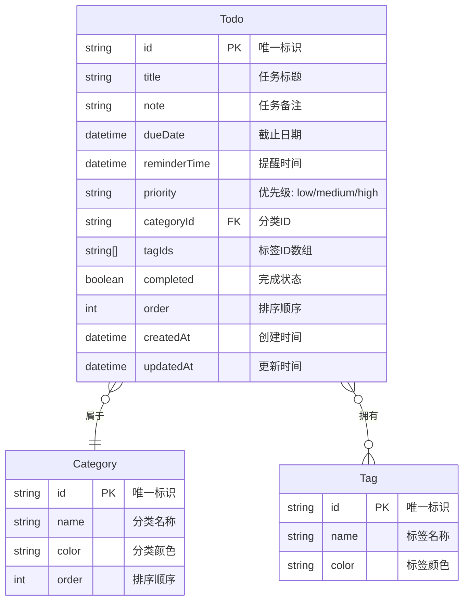

# Web 端 Todo 待办应用开发计划

## 项目概述

基于 React 技术栈开发一个功能完善的 Todo 待办应用，支持任务管理、搜索筛选、时间管理和排序功能。

---

## 一、产品需求文档 (PRD)

### 1. 产品概述

一款简洁高效的 Web 端待办事项管理应用，帮助用户轻松管理日常任务，提升工作效率。支持多维度分类、智能提醒和灵活排序，让任务管理井井有条。

### 2. 核心功能

#### 2.1 功能模块

1. **主页面**: 任务列表展示、快速操作、筛选排序
2. **任务编辑弹窗**: 新增/编辑任务详情
3. **分类管理**: 标签和分类的创建与管理

#### 2.2 页面详情

| 页面名称 | 模块名称 | 功能描述 |
|---------|---------|---------|
| 主页面 | 任务列表 | 展示所有待办任务，支持勾选完成、快速删除 |
| 主页面 | 筛选栏 | 按今日/本周/逾期筛选，按标签/分类筛选 |
| 主页面 | 搜索框 | 关键词搜索任务标题和备注 |
| 主页面 | 排序控制 | 拖拽排序、按时间/优先级排序切换 |
| 任务编辑弹窗 | 表单区域 | 填写标题、备注、时间、标签、分类、优先级 |
| 分类管理弹窗 | 标签管理 | 创建、编辑、删除标签 |
| 分类管理弹窗 | 分类管理 | 创建、编辑、删除分类 |

### 3. 核心流程

```mermaid
flowchart TD
    "用户打开应用" --> "查看任务列表"
    "查看任务列表" --> "选择操作"
    "选择操作" --> "新增任务"
    "选择操作" --> "编辑任务"
    "选择操作" --> "删除任务"
    "选择操作" --> "标记完成"
    "选择操作" --> "筛选搜索"
    "新增任务" --> "填写任务信息"
    "填写任务信息" --> "保存任务"
    "编辑任务" --> "修改任务信息"
    "修改任务信息" --> "保存任务"
    "筛选搜索" --> "按条件筛选"
    "按条件筛选" --> "查看结果"
```

### 4. 用户界面设计

#### 4.1 设计风格

- **主色调**: 深蓝色系 (#1e3a5f) 搭配活力橙色 (#f97316) 作为强调色
- **辅助色**: 浅灰色背景 (#f8fafc)、成功绿 (#22c55e)、警告红 (#ef4444)
- **字体**: 标题使用 Outfit 字体，正文使用 Inter 字体
- **布局**: 左侧导航栏 + 右侧内容区的双栏布局
- **卡片风格**: 圆角卡片，轻微阴影，悬停效果
- **图标**: 使用 lucide-react 图标库

#### 4.2 页面设计概述

| 页面名称 | 模块名称 | UI 元素 |
|---------|---------|---------|
| 主页面 | 任务列表 | 卡片式布局，每条任务一个卡片，左侧复选框，右侧操作按钮 |
| 主页面 | 筛选栏 | 水平标签栏，选中状态高亮，支持多选 |
| 主页面 | 搜索框 | 圆角输入框，带搜索图标，实时搜索 |
| 主页面 | 排序控制 | 下拉菜单或图标按钮组 |
| 任务编辑弹窗 | 表单区域 | 模态弹窗，表单字段垂直排列，底部操作按钮 |
| 分类管理弹窗 | 标签/分类列表 | 弹窗内标签页切换，列表展示，支持内联编辑 |

#### 4.3 响应式设计

- 桌面优先设计，最小宽度 1024px
- 平板适配：左侧导航可折叠
- 移动端适配：底部导航，全屏弹窗

---

## 二、技术架构文档

### 1. 架构设计

```mermaid
flowchart TB
    subgraph "前端层"
        A[React 18] --> B[Zustand 状态管理]
        A --> C[React Router 路由]
        A --> D[Tailwind CSS 样式]
    end
    
    subgraph "数据层"
        B --> E[LocalStorage 持久化]
        B --> F[内存状态]
    end
    
    subgraph "工具库"
        G[date-fns 日期处理]
        H[lucide-react 图标]
        I[@dnd-kit 拖拽排序]
    end
    
    A --> G
    A --> H
    A --> I
```

### 2. 技术栈说明

| 层级 | 技术选型 | 说明 |
|-----|---------|------|
| 前端框架 | React 18 + TypeScript | 现代化响应式开发 |
| 构建工具 | Vite | 快速开发构建 |
| 样式方案 | Tailwind CSS | 原子化 CSS |
| 状态管理 | Zustand | 轻量级状态管理 |
| 路由管理 | React Router DOM | SPA 路由 |
| 日期处理 | date-fns | 日期格式化和计算 |
| 图标库 | lucide-react | 丰富图标支持 |
| 拖拽排序 | @dnd-kit/core | 现代化拖拽方案 |
| 数据持久化 | LocalStorage | 本地数据存储 |

### 3. 路由定义

| 路由 | 用途 |
|-----|------|
| `/` | 主页面，展示所有任务 |
| `/today` | 今日待办 |
| `/week` | 本周待办 |
| `/overdue` | 逾期任务 |
| `/completed` | 已完成任务 |

### 4. 数据模型

#### 4.1 数据模型定义



#### 4.2 数据定义语言 (TypeScript 接口)

```typescript
interface Todo {
  id: string;
  title: string;
  note: string;
  dueDate: string | null;
  reminderTime: string | null;
  priority: 'low' | 'medium' | 'high';
  categoryId: string | null;
  tagIds: string[];
  completed: boolean;
  order: number;
  createdAt: string;
  updatedAt: string;
}

interface Category {
  id: string;
  name: string;
  color: string;
  order: number;
}

interface Tag {
  id: string;
  name: string;
  color: string;
}
```

### 5. 项目目录结构

```
src/
├── components/          # 可复用组件
│   ├── ui/             # 基础 UI 组件
│   │   ├── Button.tsx
│   │   ├── Input.tsx
│   │   ├── Modal.tsx
│   │   └── Checkbox.tsx
│   ├── TodoItem.tsx    # 任务项组件
│   ├── TodoList.tsx    # 任务列表组件
│   ├── FilterBar.tsx   # 筛选栏组件
│   ├── SearchBox.tsx   # 搜索框组件
│   ├── SortControl.tsx # 排序控制组件
│   └── Sidebar.tsx     # 侧边栏组件
├── pages/              # 页面组件
│   ├── Home.tsx        # 主页面
│   ├── Today.tsx       # 今日待办
│   ├── Week.tsx        # 本周待办
│   ├── Overdue.tsx     # 逾期任务
│   └── Completed.tsx   # 已完成
├── hooks/              # 自定义 Hooks
│   ├── useTodos.ts     # 任务管理 Hook
│   ├── useFilter.ts    # 筛选 Hook
│   └── useSearch.ts    # 搜索 Hook
├── store/              # Zustand 状态管理
│   ├── todoStore.ts    # 任务状态
│   ├── categoryStore.ts # 分类状态
│   └── tagStore.ts     # 标签状态
├── utils/              # 工具函数
│   ├── storage.ts      # LocalStorage 操作
│   ├── date.ts         # 日期处理
│   └── id.ts           # ID 生成
├── types/              # TypeScript 类型定义
│   └── index.ts
├── App.tsx             # 根组件
├── main.tsx            # 入口文件
└── index.css           # 全局样式
```

---

## 三、实施计划

### 阶段 1: 项目初始化与基础架构 (预计: 0.5h)

1. 使用 `react-ts` 模板初始化 Vite 项目
2. 安装依赖: zustand, react-router-dom, date-fns, lucide-react, @dnd-kit/core, @dnd-kit/sortable
3. 配置 Tailwind CSS
4. 创建项目目录结构
5. 定义 TypeScript 类型

### 阶段 2: 状态管理与数据持久化 (预计: 1h)

1. 创建 Zustand stores (todoStore, categoryStore, tagStore)
2. 实现 LocalStorage 持久化
3. 创建工具函数 (ID 生成、日期处理)

### 阶段 3: 基础 UI 组件开发 (预计: 1.5h)

1. 开发基础 UI 组件 (Button, Input, Modal, Checkbox)
2. 开发侧边栏组件 (导航、分类列表)
3. 开发搜索框组件
4. 开发筛选栏组件

### 阶段 4: 任务核心功能开发 (预计: 2h)

1. 开发 TodoItem 组件 (显示、勾选、删除)
2. 开发 TodoList 组件 (列表渲染)
3. 开发任务编辑弹窗 (新增/编辑表单)
4. 实现任务的 CRUD 操作

### 阶段 5: 高级功能开发 (预计: 2h)

1. 实现关键词搜索功能
2. 实现标签/分类筛选
3. 实现时间筛选 (今日/本周/逾期)
4. 实现拖拽排序功能
5. 实现按时间/优先级排序

### 阶段 6: 分类管理功能 (预计: 1h)

1. 开发分类管理弹窗
2. 实现标签 CRUD
3. 实现分类 CRUD

### 阶段 7: 页面路由与整合 (预计: 1h)

1. 配置 React Router
2. 创建各视图页面 (今日/本周/逾期/已完成)
3. 整合所有功能模块
4. 整体样式调整与优化

### 阶段 8: 测试与优化 (预计: 1h)

1. 功能测试
2. 响应式适配测试
3. 性能优化
4. 代码检查 (TypeScript 类型检查)

---

## 四、技术要点

### 1. 拖拽排序实现

使用 @dnd-kit 库实现任务的拖拽排序:
- `DndContext` 提供拖拽上下文
- `useSortable` Hook 处理单个任务项的拖拽
- 拖拽结束后更新任务的 `order` 属性

### 2. 时间筛选逻辑

- **今日**: `dueDate` 在今天 00:00 - 23:59 之间
- **本周**: `dueDate` 在本周一 00:00 - 本周日 23:59 之间
- **逾期**: `dueDate` 早于今天 00:00 且 `completed` 为 false

### 3. 数据持久化

使用 Zustand 的 `persist` 中间件，自动将状态同步到 LocalStorage:
```typescript
import { persist } from 'zustand/middleware';

const useTodoStore = create(
  persist(
    (set, get) => ({
      // state and actions
    }),
    { name: 'todo-storage' }
  )
);
```

### 4. 响应式设计断点

- 桌面: ≥ 1024px (默认)
- 平板: 768px - 1023px (侧边栏折叠)
- 移动: < 768px (底部导航)

---

## 五、预期成果

完成后将交付一个功能完整的 Todo 待办应用，具备:

1. ✅ 完整的任务 CRUD 功能
2. ✅ 多维度筛选 (时间、标签、分类)
3. ✅ 关键词搜索
4. ✅ 拖拽排序
5. ✅ 按时间/优先级排序
6. ✅ 本地数据持久化
7. ✅ 响应式设计
8. ✅ 现代化 UI 设计