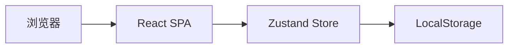
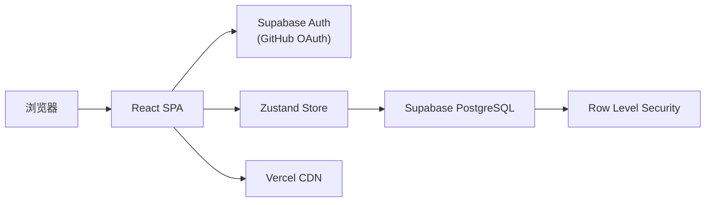

# Trae Todo v2 改造计划

> 文档类型：修改计划 / 实施记录  
> 版本：v2.0  
> 日期：2026-06-15  
> 状态：已完成

---

## 1. 改造背景

v1 版本为纯前端 Todo 应用，数据存储在浏览器 LocalStorage，存在以下局限：

| 问题 | 影响 |
|------|------|
| 数据仅存本地 | 换设备或清缓存后数据丢失 |
| 无用户体系 | 无法区分多用户数据 |
| 无云端备份 | 缺乏数据可靠性保障 |
| 仅本地运行 | 无法对外提供服务 |

本次改造目标：将应用升级为**云端同步 + GitHub 登录 + Vercel 部署**的生产级 SPA。

---

## 2. 改造目标

| 序号 | 目标 | 验收标准 |
|------|------|----------|
| G1 | Supabase 云端存储 | 任务/分类/标签 CRUD 写入 PostgreSQL，刷新后数据不丢失 |
| G2 | GitHub OAuth 登录 | 未登录跳转登录页，GitHub 授权后可正常使用 |
| G3 | 用户数据隔离 | 用户 A 无法访问用户 B 的数据（RLS 生效） |
| G4 | Vercel 部署就绪 | 提供 vercel.json、环境变量模板、SPA 路由配置 |
| G5 | 产品文档 | 输出产品说明书与改造计划文档 |

---

## 3. 架构对比

### 3.1 改造前（v1）



### 3.2 改造后（v2）



### 3.3 技术栈变更

| 模块 | v1 | v2 |
|------|----|----|
| 数据持久化 | Zustand `persist` → LocalStorage | Zustand → Supabase Client |
| 用户认证 | 无 | Supabase Auth + GitHub OAuth |
| 后端服务 | 无 | Supabase（BaaS） |
| 部署 | `npm run dev` 本地 | Vercel 生产部署 |
| 新增依赖 | — | `@supabase/supabase-js` |

---

## 4. 实施阶段

### 阶段 1：数据库设计（Supabase Schema）

**目标**：设计支持多用户的数据表结构与安全策略。

**任务清单：**

- [x] 设计 `categories` 表（含 `user_id`）
- [x] 设计 `tags` 表（含 `user_id`）
- [x] 设计 `todos` 表（含 `user_id`、外键 `category_id`）
- [x] 设计 `todo_tags` 关联表（多对多）
- [x] 编写 `001_initial_schema.sql` 迁移脚本
- [x] 配置 RLS 策略（按 `auth.uid() = user_id` 隔离）
- [x] 添加 `updated_at` 自动更新触发器

**产出文件：**

```
supabase/migrations/001_initial_schema.sql
src/types/database.ts
src/lib/mappers.ts
```

---

### 阶段 2：Supabase 客户端集成

**目标**：建立前端与 Supabase 的连接层。

**任务清单：**

- [x] 安装 `@supabase/supabase-js`
- [x] 创建 `src/lib/supabase.ts` 客户端实例
- [x] 定义 TypeScript 数据库类型
- [x] 实现 DB Row ↔ 应用 Model 映射函数
- [x] 添加 `.env.example` 环境变量模板
- [x] 更新 `vite-env.d.ts` 类型声明

**环境变量：**

| 变量 | 说明 |
|------|------|
| `VITE_SUPABASE_URL` | Supabase 项目 URL |
| `VITE_SUPABASE_ANON_KEY` | Supabase 匿名公钥 |

---

### 阶段 3：GitHub OAuth 认证

**目标**：接入 GitHub 登录，保护业务路由。

**任务清单：**

- [x] 创建 `AuthContext`（session 管理、signIn/signOut）
- [x] 实现登录页 `/login`（GitHub 登录按钮）
- [x] 实现 OAuth 回调页 `/auth/callback`
- [x] 实现 `ProtectedRoute` 路由守卫
- [x] 在 `App.tsx` 中包裹 `AuthProvider`
- [x] Sidebar 增加用户信息展示与退出登录

**认证流程：**

```
用户 → /login → GitHub 授权 → Supabase 回调
     → /auth/callback → 获取 Session → 跳转首页
```

**外部配置（需手动完成）：**

1. GitHub Developer Settings 创建 OAuth App
2. Supabase Dashboard 启用 GitHub Provider
3. 配置 Site URL 与 Redirect URLs

---

### 阶段 4：Store 重构（LocalStorage → Supabase）

**目标**：将所有数据操作从本地持久化迁移至 Supabase CRUD。

**任务清单：**

- [x] 重构 `todoStore.ts`：移除 `persist`，改为 async CRUD
- [x] 重构 `categoryStore.ts`：async CRUD + 首次登录种子数据
- [x] 重构 `tagStore.ts`：async CRUD + 首次登录种子数据
- [x] 保留 `filterSortStore.ts`（纯内存，不持久化）
- [x] 创建 `useDataSync` Hook（登录后拉取全部数据）
- [x] 各 Store 增加 `reset()` 方法（退出登录时清空）
- [x] 实现 `todo_tags` 关联同步逻辑

**Store API 变更：**

| 方法 | v1 | v2 |
|------|----|----|
| `addTodo` | 同步 | `async`，写入 Supabase 后更新本地 |
| `updateTodo` | 同步 | `async`，同步 tag 关联表 |
| `deleteTodo` | 同步 | `async` |
| `toggleComplete` | 同步 | `async` |
| `reorderTodos` | 同步 | `async`，批量更新 order |
| `fetchTodos` | 无 | 新增，登录后拉取 |
| `reset` | 无 | 新增，退出时清空 |

**组件适配：**

- [x] `TodoForm`：`handleSubmit` 改为 async
- [x] `TodoItem`：删除/完成改为 async
- [x] `CategoryManager`：增删改改为 async

---

### 阶段 5：页面与布局优化

**目标**：减少页面重复代码，统一布局与加载态。

**任务清单：**

- [x] 抽取 `AppLayout` 通用布局组件
- [x] 简化 7 个页面为 `AppLayout` + props 组合
- [x] `ProtectedRoute` 增加数据同步 Loading 态
- [x] Sidebar 底部改为用户信息 + 退出登录
- [x] 更新 `index.html` 页面标题

**页面简化示例：**

```tsx
// 改造前：每个页面 ~70 行重复布局代码
// 改造后：
export function TodayPage() {
  return (
    <AppLayout
      title="今日待办"
      icon={<Calendar />}
      timeFilter="today"
    />
  );
}
```

---

### 阶段 6：Vercel 部署配置

**目标**：使项目可直接部署至 Vercel 生产环境。

**任务清单：**

- [x] 创建 `vercel.json`（SPA rewrite 规则）
- [x] 编写 `.env.example` 模板
- [x] 在产品文档中补充部署步骤

**vercel.json 配置：**

```json
{
  "rewrites": [
    { "source": "/(.*)", "destination": "/index.html" }
  ]
}
```

**Vercel 环境变量：**

| 变量 | 环境 |
|------|------|
| `VITE_SUPABASE_URL` | Production / Preview / Development |
| `VITE_SUPABASE_ANON_KEY` | Production / Preview / Development |

---

### 阶段 7：文档输出

**目标**：沉淀改造过程与产品说明，便于后续维护与部署。

**任务清单：**

- [x] 编写 `docs/PRODUCT_SPEC.md`（产品说明书）
- [x] 编写 `docs/MIGRATION_PLAN.md`（本文档）

---

## 5. 文件变更清单

### 5.1 新增文件

| 文件 | 说明 |
|------|------|
| `supabase/migrations/001_initial_schema.sql` | 数据库迁移脚本 |
| `src/lib/supabase.ts` | Supabase 客户端 |
| `src/lib/mappers.ts` | 数据模型映射 |
| `src/types/database.ts` | Supabase 类型定义 |
| `src/contexts/AuthContext.tsx` | 认证上下文 |
| `src/hooks/useDataSync.ts` | 登录后数据同步 |
| `src/pages/Login.tsx` | 登录页 |
| `src/pages/AuthCallback.tsx` | OAuth 回调页 |
| `src/components/ProtectedRoute.tsx` | 路由守卫 |
| `src/components/AppLayout.tsx` | 通用页面布局 |
| `vercel.json` | Vercel 部署配置 |
| `.env.example` | 环境变量模板 |
| `docs/PRODUCT_SPEC.md` | 产品说明书 |
| `docs/MIGRATION_PLAN.md` | 改造计划（本文档） |

### 5.2 修改文件

| 文件 | 变更说明 |
|------|----------|
| `package.json` | 新增 `@supabase/supabase-js` 依赖 |
| `src/App.tsx` | 增加 AuthProvider、登录/回调路由、ProtectedRoute |
| `src/store/todoStore.ts` | 移除 persist，改为 Supabase async CRUD |
| `src/store/categoryStore.ts` | 同上 + 默认分类种子 |
| `src/store/tagStore.ts` | 同上 + 默认标签种子 |
| `src/components/Sidebar.tsx` | 用户信息、退出登录 |
| `src/components/TodoForm.tsx` | async 提交 |
| `src/components/TodoItem.tsx` | async 删除/完成 |
| `src/components/CategoryManager.tsx` | async 增删改 |
| `src/pages/Home.tsx` | 简化为 AppLayout |
| `src/pages/Today.tsx` | 简化为 AppLayout |
| `src/pages/Week.tsx` | 简化为 AppLayout |
| `src/pages/Overdue.tsx` | 简化为 AppLayout |
| `src/pages/Completed.tsx` | 简化为 AppLayout |
| `src/pages/CategoryPage.tsx` | 简化为 AppLayout |
| `src/vite-env.d.ts` | 环境变量类型 |
| `index.html` | 页面标题 |

### 5.3 未变更文件

| 文件 | 说明 |
|------|------|
| `src/store/filterSortStore.ts` | 筛选排序仍为内存状态 |
| `src/components/TodoList.tsx` | 筛选/排序/拖拽逻辑不变 |
| `src/components/FilterBar.tsx` | 无变更 |
| `src/components/SearchBox.tsx` | 无变更 |
| `src/components/SortControl.tsx` | 无变更 |
| `src/types/index.ts` | 应用数据模型不变 |
| `src/utils/date.ts` | 日期工具不变 |

---

## 6. 数据迁移说明

> v1 LocalStorage 数据**不会自动迁移**至 Supabase。

| 存储 Key | v1 内容 | v2 处理方式 |
|----------|---------|-------------|
| `todo-storage` | 任务列表 | 废弃，登录后从 Supabase 拉取 |
| `category-storage` | 分类列表 | 废弃，首次登录自动创建默认分类 |
| `tag-storage` | 标签列表 | 废弃，首次登录自动创建默认标签 |

如需保留 v1 数据，可手动导出 LocalStorage JSON 后编写一次性导入脚本（未纳入本次范围）。

---

## 7. 部署检查清单

部署前请逐项确认：

### Supabase

- [ ] 项目已创建
- [ ] `001_initial_schema.sql` 已在 SQL Editor 执行
- [ ] GitHub Provider 已启用并配置 Client ID / Secret
- [ ] Site URL 已设置为 Vercel 域名
- [ ] Redirect URLs 包含 `https://your-app.vercel.app/auth/callback`
- [ ] Redirect URLs 包含 `http://localhost:5173/auth/callback`（本地开发）

### GitHub OAuth App

- [ ] OAuth App 已创建
- [ ] Homepage URL 指向 Vercel 域名
- [ ] Authorization callback URL 指向 Supabase 回调地址

### Vercel

- [ ] 项目已关联 GitHub 仓库
- [ ] `VITE_SUPABASE_URL` 环境变量已配置
- [ ] `VITE_SUPABASE_ANON_KEY` 环境变量已配置
- [ ] 构建成功，页面可访问
- [ ] GitHub 登录流程端到端可用

### 本地开发

- [ ] `.env.local` 已配置（从 `.env.example` 复制）
- [ ] `npm run dev` 可正常启动
- [ ] 登录 → 增删改查 → 退出 流程正常

---

## 8. 风险与注意事项

| 风险 | 说明 | 缓解措施 |
|------|------|----------|
| Anon Key 暴露 | `VITE_` 变量会打包进前端 | 依赖 RLS 策略保护数据，禁止使用 Service Role Key |
| OAuth 回调失败 | Redirect URL 配置错误 | 严格对照 Supabase / GitHub / Vercel 三处 URL |
| 首次加载慢 | 登录后需拉取三类数据 | ProtectedRoute 显示 Loading 态 |
| 删除分类/标签 | 关联任务不会删除 | 分类 `ON DELETE SET NULL`，标签关联 CASCADE 删除 |
| v1 数据丢失 | 无自动迁移 | 文档说明，必要时手动导入 |

---

## 9. 后续可选优化

| 优先级 | 项 | 说明 |
|--------|-----|------|
| P1 | Realtime 订阅 | Supabase Realtime 实现多标签页实时同步 |
| P1 | 错误 Toast | 替换 `alert()` 为统一 Toast 组件 |
| P2 | Optimistic Update | Store 层乐观更新，提升操作响应速度 |
| P2 | v1 数据导入工具 | 读取 LocalStorage 一键导入 Supabase |
| P3 | Supabase CLI | 本地 migration 管理、`supabase db push` |
| P3 | E2E 测试 | Playwright 覆盖登录与 CRUD 流程 |

---

## 10. 相关文档

| 文档 | 路径 | 用途 |
|------|------|------|
| 产品说明书 | [docs/PRODUCT_SPEC.md](./PRODUCT_SPEC.md) | 功能、架构、部署指南 |
| 改造计划 | [docs/MIGRATION_PLAN.md](./MIGRATION_PLAN.md) | 本文档 |
| v1 开发计划 | [.trae/documents/todo-app-plan.md](../.trae/documents/todo-app-plan.md) | 初始版本 PRD 与实施计划 |
| 环境变量模板 | [.env.example](../.env.example) | 本地/Vercel 环境配置 |
| 数据库迁移 | [supabase/migrations/001_initial_schema.sql](../supabase/migrations/001_initial_schema.sql) | Schema + RLS |

---

*本文档记录 Trae Todo v1 → v2 的完整改造计划与实施状态，与 [PRODUCT_SPEC.md](./PRODUCT_SPEC.md) 配合使用。*
