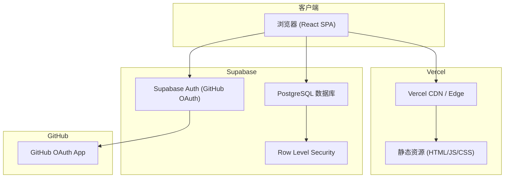
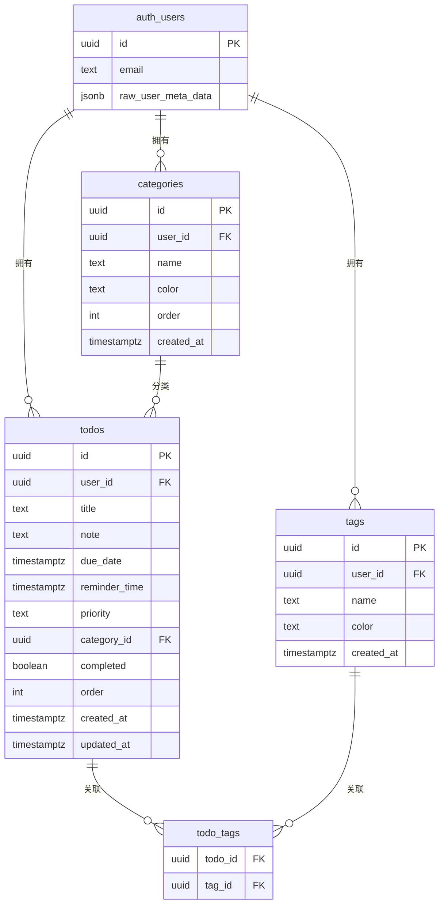
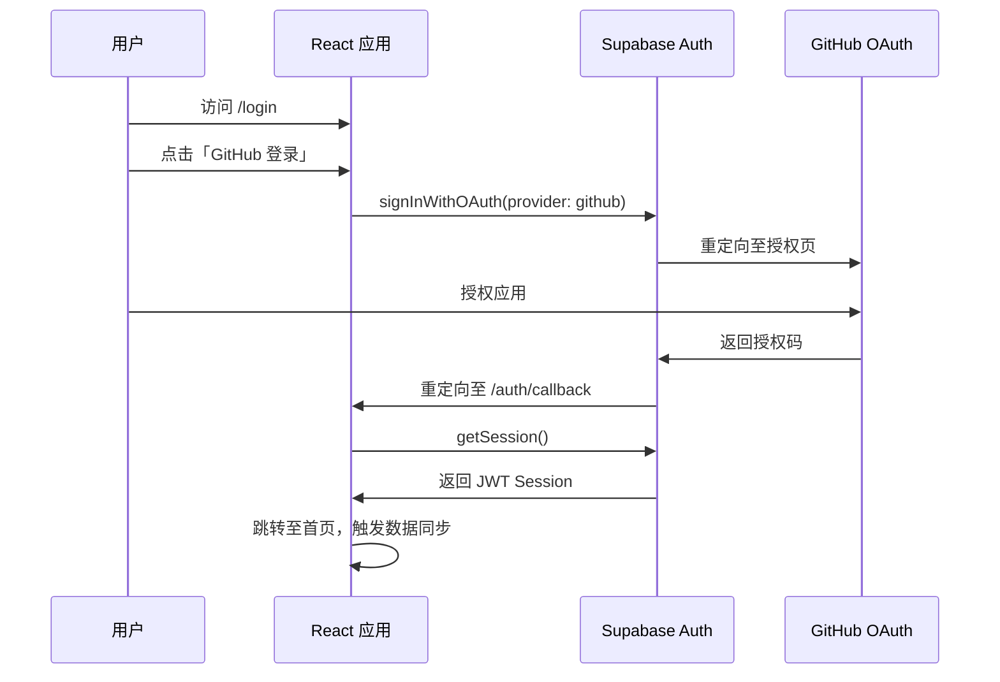

# Trae Todo 待办应用 — 产品说明书

> 版本：v2.0  
> 更新日期：2026-06-15  
> 部署平台：Vercel  
> 数据存储：Supabase  
> 认证方式：GitHub OAuth

---

## 1. 产品概述

**Trae Todo** 是一款面向个人与小型团队的高效 Web 端待办事项管理应用。用户通过 GitHub 账号登录后，可在任意设备上访问、管理任务，数据实时同步至 Supabase 云端数据库。

### 1.1 产品定位

| 维度 | 说明 |
|------|------|
| 目标用户 | 需要轻量任务管理的开发者、学生、自由职业者 |
| 核心价值 | 简洁高效、多维度分类、云端同步、GitHub 一键登录 |
| 使用场景 | 日常工作安排、学习计划、项目任务跟踪 |

### 1.2 版本变更（v1 → v2）

| 项目 | v1（本地版） | v2（云端版） |
|------|-------------|-------------|
| 数据存储 | LocalStorage | Supabase PostgreSQL |
| 用户认证 | 无 | GitHub OAuth |
| 多设备同步 | 不支持 | 支持 |
| 数据隔离 | 无 | 按用户 RLS 隔离 |
| 部署 | 本地运行 | Vercel 生产部署 |

---

## 2. 功能说明

### 2.1 用户认证

- **GitHub 登录**：点击「使用 GitHub 登录」，跳转 GitHub 授权页，授权后自动返回应用
- **会话管理**：Supabase Auth 自动维护登录态，刷新页面无需重新登录
- **退出登录**：侧边栏底部「退出登录」，清除本地会话

### 2.2 任务管理

| 功能 | 描述 |
|------|------|
| 新增任务 | 填写标题、备注、截止日期、提醒时间、优先级、分类、标签 |
| 编辑任务 | 点击任务卡片编辑按钮，在弹窗中修改 |
| 删除任务 | 点击删除按钮，确认后从云端移除 |
| 标记完成 | 勾选复选框切换完成状态 |
| 拖拽排序 | 鼠标悬停显示拖拽手柄，拖动调整顺序 |

**任务字段说明：**

| 字段 | 类型 | 必填 | 说明 |
|------|------|------|------|
| 标题 | 文本 | 是 | 任务名称 |
| 备注 | 文本 | 否 | 详细描述 |
| 截止日期 | 日期 | 否 | 用于时间视图筛选 |
| 提醒时间 | 日期时间 | 否 | 预留字段，暂未实现推送通知 |
| 优先级 | 枚举 | 是 | 低 / 中 / 高，默认「中」 |
| 分类 | 单选 | 否 | 关联一个分类 |
| 标签 | 多选 | 否 | 可关联多个标签 |

### 2.3 视图与筛选

#### 时间视图（侧边栏导航）

| 视图 | 路由 | 筛选规则 |
|------|------|----------|
| 全部任务 | `/` | 显示所有任务 |
| 今日待办 | `/today` | 截止日期为今天且未完成 |
| 本周待办 | `/week` | 截止日期在本周且未完成 |
| 逾期任务 | `/overdue` | 截止日期早于今天且未完成 |
| 已完成 | `/completed` | 已完成任务 |

#### 分类与标签视图

| 视图 | 路由 | 筛选规则 |
|------|------|----------|
| 分类视图 | `/category/:categoryId` | 属于指定分类的任务 |
| 标签视图 | `/tag/:tagId` | 包含指定标签的任务 |

#### 搜索与筛选

- **关键词搜索**：实时搜索任务标题和备注
- **标签筛选**：FilterBar 中多选标签（OR 逻辑）
- **排序方式**：自定义顺序 / 截止时间 / 优先级 / 创建时间，支持升序/降序

### 2.4 分类与标签管理

通过侧边栏「分类」区域的设置按钮打开管理弹窗：

- **分类 Tab**：创建、编辑（名称+颜色）、删除分类
- **标签 Tab**：创建、编辑（名称+颜色）、删除标签
- **默认数据**：首次登录自动创建默认分类（工作、个人、学习）和标签（紧急、重要、会议）

### 2.5 数据同步

- 登录后自动从 Supabase 拉取当前用户的全部数据
- 所有 CRUD 操作实时写入 Supabase
- 退出登录后清空本地内存状态

---

## 3. 技术架构

### 3.1 架构图



### 3.2 技术栈

| 层级 | 技术 | 版本 | 用途 |
|------|------|------|------|
| 前端框架 | React | 18.x | UI 渲染 |
| 语言 | TypeScript | 5.8 | 类型安全 |
| 构建工具 | Vite | 6.x | 开发/打包 |
| 样式 | Tailwind CSS | 3.x | 原子化 CSS |
| 状态管理 | Zustand | 5.x | 客户端状态 |
| 路由 | React Router | 7.x | SPA 路由 |
| 后端服务 | Supabase | - | 数据库 + 认证 |
| 拖拽 | @dnd-kit | 6.x | 任务排序 |
| 日期 | date-fns | 4.x | 时间处理 |
| 部署 | Vercel | - | 生产托管 |

### 3.3 项目目录结构

```
trae/
├── src/
│   ├── main.tsx                 # 应用入口
│   ├── App.tsx                  # 路由 + AuthProvider
│   ├── contexts/
│   │   └── AuthContext.tsx      # GitHub 认证上下文
│   ├── hooks/
│   │   └── useDataSync.ts       # 登录后数据同步
│   ├── lib/
│   │   ├── supabase.ts          # Supabase 客户端
│   │   └── mappers.ts           # DB ↔ 应用模型映射
│   ├── store/
│   │   ├── todoStore.ts         # 任务状态（Supabase CRUD）
│   │   ├── categoryStore.ts     # 分类状态
│   │   ├── tagStore.ts          # 标签状态
│   │   └── filterSortStore.ts   # 筛选排序（内存）
│   ├── pages/
│   │   ├── Login.tsx            # 登录页
│   │   ├── AuthCallback.tsx     # OAuth 回调
│   │   └── ...                  # 业务页面
│   ├── components/
│   │   ├── ProtectedRoute.tsx   # 路由守卫
│   │   ├── AppLayout.tsx        # 通用页面布局
│   │   └── ...
│   └── types/
│       ├── index.ts             # 应用数据模型
│       └── database.ts          # Supabase 类型
├── supabase/
│   └── migrations/
│       └── 001_initial_schema.sql  # 数据库迁移
├── vercel.json                  # Vercel SPA 路由配置
├── .env.example                 # 环境变量模板
└── docs/
    └── PRODUCT_SPEC.md          # 本文档
```

---

## 4. 数据模型

### 4.1 ER 关系图



### 4.2 安全策略（RLS）

所有数据表启用 Row Level Security，策略规则：

- **SELECT / INSERT / UPDATE / DELETE**：仅允许 `auth.uid() = user_id` 的操作
- **todo_tags**：通过关联 todos 表的 user_id 间接校验

---

## 5. 认证流程



---

## 6. 部署指南

### 6.1 Supabase 配置

#### Step 1：创建项目

1. 登录 [Supabase Dashboard](https://supabase.com/dashboard)
2. 点击 **New Project**，填写项目名称与数据库密码
3. 等待项目创建完成

#### Step 2：执行数据库迁移

1. 进入 **SQL Editor**
2. 复制 `supabase/migrations/001_initial_schema.sql` 内容
3. 点击 **Run** 执行

#### Step 3：配置 GitHub OAuth

1. 在 [GitHub Developer Settings](https://github.com/settings/developers) 创建 **OAuth App**
   - **Application name**：Trae Todo
   - **Homepage URL**：`https://your-app.vercel.app`（部署后填写）
   - **Authorization callback URL**：`https://your-project-id.supabase.co/auth/v1/callback`
2. 复制 Client ID 和 Client Secret
3. 在 Supabase Dashboard → **Authentication** → **Providers** → **GitHub**
   - 启用 GitHub Provider
   - 填入 Client ID 和 Client Secret
4. 在 **Authentication** → **URL Configuration** 中设置：
   - **Site URL**：`https://your-app.vercel.app`
   - **Redirect URLs**：`https://your-app.vercel.app/auth/callback`

#### Step 4：获取 API 密钥

在 **Project Settings** → **API** 中复制：

- **Project URL** → `VITE_SUPABASE_URL`
- **anon public key** → `VITE_SUPABASE_ANON_KEY`

### 6.2 Vercel 部署

#### Step 1：推送代码至 GitHub

```bash
git add .
git commit -m "feat: migrate to Supabase with GitHub auth"
git push origin main
```

#### Step 2：导入 Vercel 项目

1. 登录 [Vercel Dashboard](https://vercel.com/dashboard)
2. 点击 **Add New** → **Project**
3. 选择 GitHub 仓库 `trae`
4. Framework Preset 自动识别为 **Vite**

#### Step 3：配置环境变量

在 Vercel 项目 **Settings** → **Environment Variables** 中添加：

| 变量名 | 值 | 环境 |
|--------|-----|------|
| `VITE_SUPABASE_URL` | `https://xxx.supabase.co` | Production, Preview, Development |
| `VITE_SUPABASE_ANON_KEY` | `eyJhbG...` | Production, Preview, Development |

#### Step 4：部署

点击 **Deploy**，等待构建完成。部署成功后访问 Vercel 提供的域名。

#### Step 5：更新 OAuth 回调地址

将 Vercel 生产域名更新到：

- GitHub OAuth App 的 Homepage URL
- Supabase 的 Site URL 和 Redirect URLs

### 6.3 本地开发

```bash
# 1. 安装依赖
npm install

# 2. 配置环境变量
cp .env.example .env.local
# 编辑 .env.local，填入 Supabase URL 和 Anon Key

# 3. 启动开发服务器
npm run dev
```

本地开发时，Supabase Redirect URLs 需额外添加：

```
http://localhost:5173/auth/callback
```

GitHub OAuth App 的 Homepage URL 本地开发可设为 `http://localhost:5173`。

---

## 7. 环境变量

| 变量名 | 必填 | 说明 | 获取方式 |
|--------|------|------|----------|
| `VITE_SUPABASE_URL` | 是 | Supabase 项目 URL | Dashboard → Settings → API |
| `VITE_SUPABASE_ANON_KEY` | 是 | Supabase 匿名公钥 | Dashboard → Settings → API |

> 注意：`VITE_` 前缀的环境变量会暴露在前端代码中。Anon Key 配合 RLS 策略使用是安全的，切勿将 Service Role Key 放入前端。

---

## 8. 用户界面

### 8.1 设计风格

| 元素 | 规范 |
|------|------|
| 主色调 | 深蓝色 `#1e3a5f` |
| 强调色 | 活力橙 `#f97316` |
| 背景色 | 浅灰 `#f8fafc` |
| 成功色 | 绿色 `#22c55e` |
| 警告色 | 红色 `#ef4444` |
| 布局 | 左侧导航栏 (256px) + 右侧内容区 |
| 卡片 | 圆角 `xl`，轻微阴影，悬停加深 |

### 8.2 页面一览

| 页面 | 路径 | 说明 |
|------|------|------|
| 登录页 | `/login` | GitHub 登录入口 |
| OAuth 回调 | `/auth/callback` | 认证回调处理 |
| 全部任务 | `/` | 主页面 |
| 今日待办 | `/today` | 今日截止任务 |
| 本周待办 | `/week` | 本周截止任务 |
| 逾期任务 | `/overdue` | 已过期未完成任务 |
| 已完成 | `/completed` | 已完成任务列表 |
| 分类视图 | `/category/:id` | 按分类筛选 |
| 标签视图 | `/tag/:id` | 按标签筛选 |

---

## 9. 常见问题

### Q1：登录后页面空白或报错？

检查 Vercel 环境变量是否正确配置，Supabase Redirect URLs 是否包含当前域名。

### Q2：数据不同步？

确认 Supabase 数据库迁移已执行，RLS 策略已启用。打开浏览器开发者工具查看 Network 请求是否有 401/403 错误。

### Q3：GitHub 登录跳转失败？

确认 GitHub OAuth App 的 Authorization callback URL 为 Supabase 提供的回调地址（非应用地址）。

### Q4：本地开发无法登录？

在 Supabase Redirect URLs 中添加 `http://localhost:5173/auth/callback`。

### Q5：删除分类后关联任务会怎样？

任务的 `category_id` 会被设为 `NULL`（数据库 `ON DELETE SET NULL`），任务不会被删除。

---

## 10. 后续规划

| 优先级 | 功能 | 说明 |
|--------|------|------|
| P1 | 提醒通知 | 基于 `reminder_time` 的浏览器/推送通知 |
| P1 | 离线支持 | Service Worker + 本地缓存 |
| P2 | 任务协作 | 多用户共享任务列表 |
| P2 | 数据导入导出 | JSON/CSV 格式 |
| P3 | 移动端适配 | 响应式布局优化 |
| P3 | 深色模式 | 主题切换 |

---

## 11. 附录

### 11.1 相关链接

- [Supabase 文档](https://supabase.com/docs)
- [Vercel 文档](https://vercel.com/docs)
- [React Router 文档](https://reactrouter.com/)
- [Zustand 文档](https://zustand.docs.pmnd.rs/)

### 11.2 构建命令

```bash
npm run dev       # 本地开发
npm run build     # 生产构建
npm run preview   # 预览构建结果
npm run lint      # ESLint 检查
npm run check     # TypeScript 类型检查
```

---

*本文档由 Trae 项目自动生成，如有疑问请联系项目维护者。*
